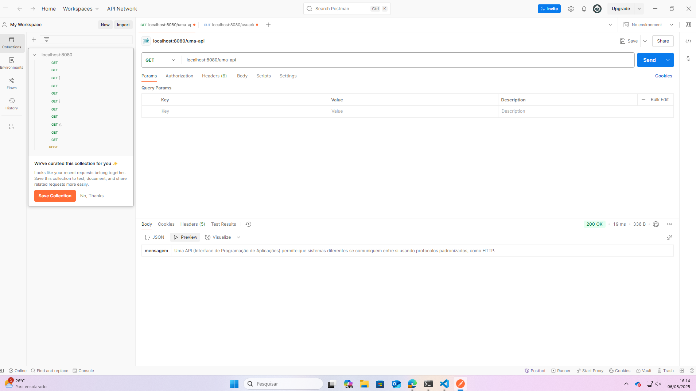
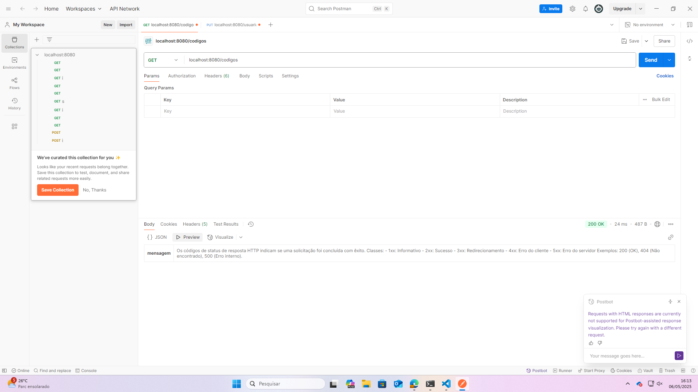
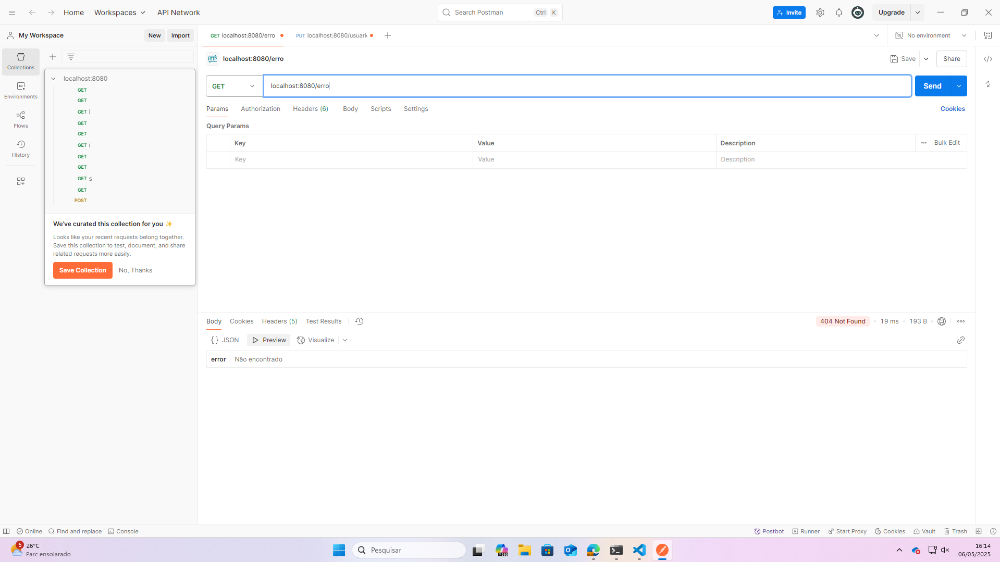

# dsw_ava_2

**Nome completo:** Sophia da costa morreira
**Data:** 18/04/2009
**Unidade Curricular:** Desenvolvimento de Sistemas Web

---

## O que é uma API REST?

Uma API REST é uma interface que permite a comunicação entre sistemas usando o protocolo HTTP, com operações como GET, POST, PUT e DELETE. Ela segue princípios como a utilização de URIs e respostas em formato padronizado, geralmente JSON.

---

## Sobre os Códigos de Erros HTTP

Os códigos de status de resposta HTTP indicam se uma solicitação foi concluída com êxito. 
Classes:
- 1xx: Informativo
- 2xx: Sucesso
- 3xx: Redirecionamento
- 4xx: Erro do cliente
- 5xx: Erro do servidor Exemplos:

- **200 OK** – Requisição bem-sucedida.
- **404 Not Found** – O recurso solicitado não foi encontrado.
- **500 Internal Server Error** – Erro inesperado no servidor.

---

## Diferença entre JSON, Texto Plano e XML

- **JSON** (JavaScript Object Notation): Estrutura leve de dados, muito usada em APIs, fácil de ler e interpretar.
- **Texto Plano**: Conteúdo sem formatação, apenas texto bruto.
- **XML**: Linguagem de marcação com estrutura hierárquica, semelhante ao HTML, usada antes do JSON para troca de dados.

---

## Como testar este projeto

1. Instale as dependências com:

    ```bash
    composer install
    ```

2. Execute o servidor embutido do PHP:

    ```bash
    php -S localhost:8080
    ```

3. Acesse os endpoints no navegador ou via Postman:

    - `http://localhost:8080/uma-api`
    - `http://localhost:8080/codigos`
    - `http://localhost:8080/erro`

4. Exemplos:



---

## Requisitos

- PHP 8.0 ou superior
- Composer instalado
